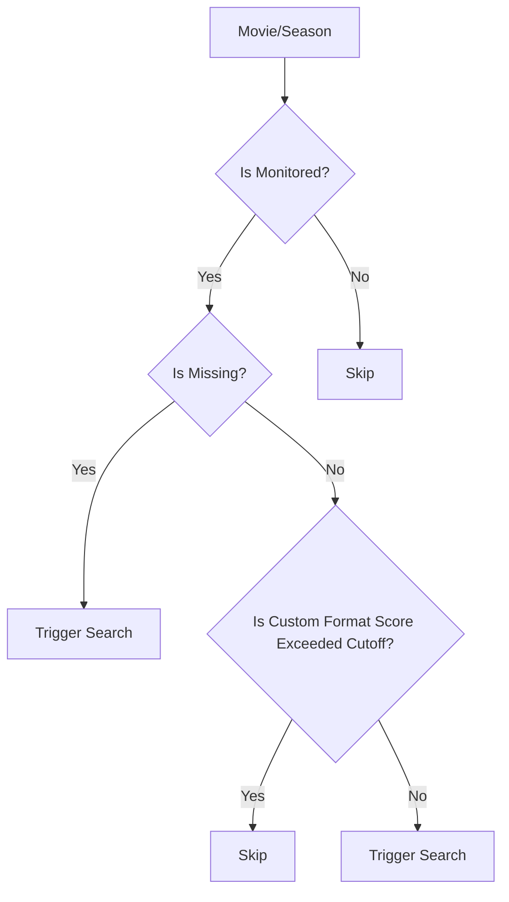

# Upgraderr

## Intro

After the whole `Huntarr` fallout, I realized I missed the functionality of a service like it that would constantly search for and upgrade my media in `Sonarr` and `Radarr`. There are scripts like [upgradinatorr](https://github.com/angrycuban13/Just-A-Bunch-Of-Starr-Scripts/blob/main/Upgradinatorr/README.md) and [daps](https://github.com/Drazzilb08/daps) that exists, so it may suit you better, but I wanted to customize the approach for searching a little bit more. One major difference between my script compared to `daps` is the way that `sonarr` searches are performed.

## How does it work ?

By just defining your `Arr` apps `Upgraderr` will retrieve all of your media and attempt to trigger indexer searches based on the following decision tree:

## Why do I even need this?

I noticed a lot of people never really understood the want for this kind of application and to be fair it is catered to a really specific want that the `Arr` apps don't fulfill. `Arr` apps perform full indexer searches when clicking on a button from their UI or from applications like `Seerr` when requesting media. But once an Episode or Season from a Series is added, after the initial search, the `Arr` apps rely purely on RSS Feeds for searching. So if you ever join a new tracker or if you missed a release due to rate-limiting from an indexer, there's a good chance you missed a high quality media file. This script aims to solve that by periodically triggering full searches for your media items.

## Searching

`Upgraderr` runs in intervals of `SEARCH_INTERVAL` minutes and attempts to search `MAX_SEARCH_LIMIT` items in a single run.

### Radarr

The way that searches are performed in `Radarr` are very much like any other script listed above, which is simply sending a search command to `Radarr` and allowing to pick the best release based on what you have defined in your instance.

### Sonarr

There are two approaches that are utilized in `Sonarr`, the first is using search commands. It works slightly different in that for `Sonarr`, if it doesn't find an appropriate season release, it will attempt to individually look through episodes that can be upgraded and trigger search tasks for them. One thing that this script will do is to avoid the possibility of single episode searches by performing a manual season and getting the best season release that would improve at least one episode within the season. You can enable this option by simply setting `SONARR_SEARCH` to `release`. I preferred this approach since it kept the viewing experience for seasons to be uniform since they would all be from the same release group.

## Configuration

These are the different environment variables that can be configured:

| Variable                  | Default   | Description                                                                                                                                                                                    |
| ------------------------- | --------- | ---------------------------------------------------------------------------------------------------------------------------------------------------------------------------------------------- |
| `SONARR_URL`              | `none`    | The URL of your Sonarr instance                                                                                                                                                                |
| `SONARR_API_KEY`          | `none`    | The API key for your Sonarr instance                                                                                                                                                           |
| `RADARR_URL`              | `none`    | The URL of your Radarr instance                                                                                                                                                                |
| `RADARR_API_KEY`          | `none`    | The API key for your Radarr instance                                                                                                                                                           |
| `DRY_RUN`                 | `true`    | If set to `true ` the script will not trigger any searches                                                                                                                                     |
| `LOG_LEVEL`               | `INFO`    | The log level for the script, either `INFO` or `DEBUG`                                                                                                                                         |
| `LOGS_DIRECTORY`          | `/logs`   | The directory where the logs are stored                                                                                                                                                        |
| `MAX_SEARCH_LIMIT`        | `20`      | The maximum number of searches that can be triggered in a single run                                                                                                                           |
| `NOTIFICATION_URL`        | `none`    | An Apprise URL for notifications                                                                                                                                                               |
| `ONE_SHOT`                | `false`   | If set to `true` the script will run once and then exit                                                                                                                                        |
| `SEARCH_INTERVAL`         | `5`       | The interval (in minutes) between searches                                                                                                                                                     |
| `SEARCH_REFRESH_INTERVAL` | `84600`   | The interval (in minutes) after which a media item will be searched again                                                                                                                      |
| `SONARR_SEARCH`           | `command` | The type of search that will be performed for a season. `command` is the same as clicking on search in sonarr. `release` attempts to run an interactive search and picks the best season pack. |

## Notifications

`Upgraderr` uses [apprise](https://appriseit.com/services/) for notification handling, so any service that is supported there is supported in this application!
